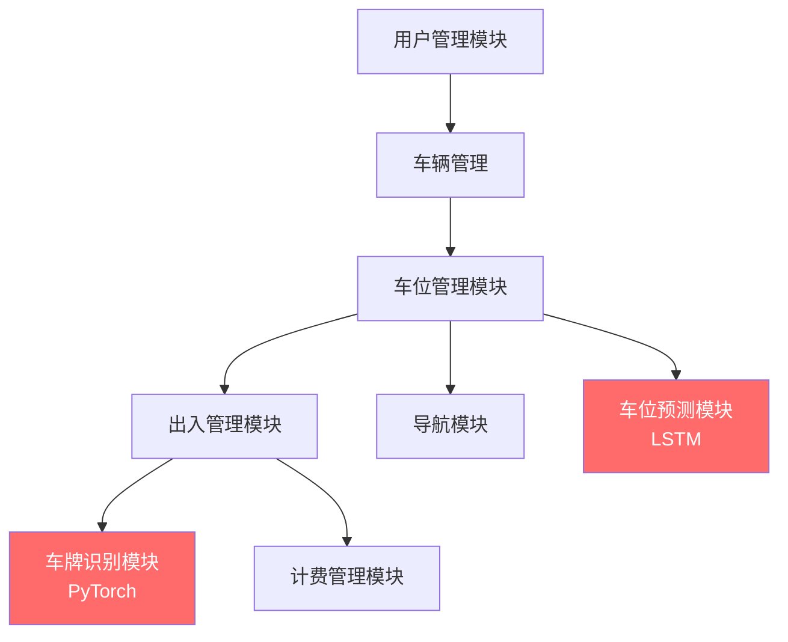

# 基于微信小程序的智能停车场系统 —— 系统设计文档

## 一、系统总体设计

### 1.1 设计原则

| 原则 | 描述 |
|------|------|
| 模块化设计 | 系统按功能划分为独立模块，模块间通过接口通信，降低耦合 |
| 前后端分离 | 前端（UniApp）和后端（FastAPI）独立开发部署，通过 RESTful API 交互 |
| 分层架构 | 表现层、业务逻辑层、数据访问层三层分离，职责清晰 |
| AI 模块独立 | 深度学习模型独立封装，便于训练、更新和替换 |

### 1.2 系统架构设计

```
┌───────────────────────────────────────────────────────────────────┐
│                         表现层 (Presentation Layer)                │
│  ┌──────────────────────────────────────────────────────────────┐ │
│  │                   UniApp 微信小程序                           │ │
│  │  ┌────────┐ ┌────────┐ ┌────────┐ ┌────────┐ ┌────────┐   │ │
│  │  │ 首页   │ │ 车位   │ │ 出入   │ │ 导航   │ │ 预测   │   │ │
│  │  │ 概览   │ │ 管理   │ │ 模拟   │ │ 页面   │ │ 页面   │   │ │
│  │  └────────┘ └────────┘ └────────┘ └────────┘ └────────┘   │ │
│  └──────────────────────────────────────────────────────────────┘ │
├───────────────────────────────────────────────────────────────────┤
│                         HTTP / WebSocket                          │
├───────────────────────────────────────────────────────────────────┤
│                        业务逻辑层 (Business Logic Layer)           │
│  ┌──────────────────────────────────────────────────────────────┐ │
│  │                    FastAPI Web 框架                           │ │
│  │  ┌─────────────────────────────────────────────────────────┐ │ │
│  │  │                     路由层 (Routers)                     │ │ │
│  │  │  auth │ spots │ parking │ recognize │ navigation │ predict│ │
│  │  └─────────────────────────────────────────────────────────┘ │ │
│  │  ┌─────────────────────────────────────────────────────────┐ │ │
│  │  │                    服务层 (Services)                     │ │ │
│  │  │  AuthService │ SpotService │ FeeService │ NavService    │ │ │
│  │  └─────────────────────────────────────────────────────────┘ │ │
│  │  ┌─────────────────────────────────────────────────────────┐ │ │
│  │  │                    AI 引擎层 (AI Engine)                 │ │ │
│  │  │  PlateDetector(YOLOv5) │ PlateRecognizer(LPRNet)       │ │ │
│  │  │  ParkingPredictor(LSTM)                                 │ │ │
│  │  └─────────────────────────────────────────────────────────┘ │ │
│  └──────────────────────────────────────────────────────────────┘ │
├───────────────────────────────────────────────────────────────────┤
│                       数据访问层 (Data Access Layer)               │
│  ┌──────────────────────────────────────────────────────────────┐ │
│  │  SQLAlchemy ORM │ PyMySQL Driver                             │ │
│  └──────────────────────────────────────────────────────────────┘ │
├───────────────────────────────────────────────────────────────────┤
│                       数据存储层 (Data Storage Layer)              │
│  ┌──────────────┐  ┌──────────────┐  ┌──────────────┐           │
│  │  MySQL 8.0   │  │  文件存储     │  │  模型权重     │           │
│  │  关系数据     │  │  上传图片     │  │  .pth 文件    │           │
│  └──────────────┘  └──────────────┘  └──────────────┘           │
└───────────────────────────────────────────────────────────────────┘
```

---

## 二、功能模块设计

### 2.1 模块划分与依赖关系



### 2.2 各模块详细设计

#### 2.2.1 用户管理模块

**职责**：处理用户注册、登录、认证和个人信息管理。

| 组件 | 功能 |
|------|------|
| `routers/auth.py` | 提供注册、登录 API 接口 |
| `services/auth_service.py` | 密码加密、JWT 令牌生成与验证 |
| `schemas/user.py` | 请求/响应数据验证模型 |

**认证流程**：
```
用户提交手机号+密码 → 服务端验证 → 生成 JWT Token → 返回前端
前端携带 Token 请求 → 后端中间件验证 Token → 放行或拒绝
```

#### 2.2.2 车位管理模块

**职责**：管理车位基础信息、实时状态和共享功能。

| 组件 | 功能 |
|------|------|
| `routers/spots.py` | 车位 CRUD、状态更新、批量查询 |
| `services/spot_service.py` | 车位分配逻辑、状态变更、WebSocket 推送 |

**状态机设计**：
```
           上传空闲
  free ◀──────────── occupied
    │                    ▲
    │ 车辆入场            │ 车辆出场
    ▼                    │
  occupied ──────────▶ free
    │
    │ 业主预留
    ▼
  reserved ────────▶ free
           取消预留
```

#### 2.2.3 车牌识别模块

**职责**：基于 PyTorch 的两阶段车牌识别（检测 + 识别），不依赖外部 OCR。

| 组件 | 功能 |
|------|------|
| `ai/plate_recognition/detector.py` | YOLOv5 车牌区域检测 |
| `ai/plate_recognition/recognizer.py` | LPRNet 车牌字符识别 |
| `ai/plate_recognition/pipeline.py` | 完整识别流水线封装 |
| `routers/recognize.py` | 图片上传与识别结果 API |

**识别流水线**：
```
输入图像(640×640) → YOLOv5 前向传播 → NMS 后处理 → 裁剪车牌区域
     → 图像预处理(94×24) → LPRNet 前向传播 → CTC 解码 → 输出车牌号
```

#### 2.2.4 出入管理与模拟模块

**职责**：处理车辆入场和出场的完整业务流程，提供模拟演示界面。

| 组件 | 功能 |
|------|------|
| `routers/parking.py` | 入场/出场处理 API |
| `services/parking_service.py` | 入场逻辑（识别→判断→分配→计时）、出场逻辑（识别→计费→释放） |

#### 2.2.5 计费管理模块

**职责**：根据停车时长和计费规则计算停车费用。

| 组件 | 功能 |
|------|------|
| `services/fee_service.py` | 费用计算引擎 |

**计费规则**：
```
if 停车时长 ≤ 30分钟:
    fee = 0（免费）
elif 是小区车辆:
    fee = 0（免费）
else:
    hours = ceil(停车时长 / 60)
    fee = min(hours × 5, 50)  # 每小时5元，每日封顶50元
```

#### 2.2.6 停车场导航模块

**职责**：停车场内部路径规划，引导车辆至空闲车位。

| 组件 | 功能 |
|------|------|
| `routers/navigation.py` | 停车场地图数据和路径规划 API |
| `services/navigation_service.py` | A* 寻路算法实现 |

**地图网格化设计**：
```
停车场平面图 → 网格化（每格代表1m×1m） → 标记可通行/不可通行区域
入口坐标 + 目标车位坐标 → A* 搜索 → 输出路径节点序列
前端 Canvas → 绘制地图 + 路径动画
```

#### 2.2.7 车位预测模块

**职责**：基于 LSTM 深度学习模型预测车位占用趋势。

| 组件 | 功能 |
|------|------|
| `ai/prediction/lstm_model.py` | LSTM 网络结构定义 |
| `ai/prediction/train.py` | 模型训练脚本 |
| `ai/prediction/predict_service.py` | 预测服务（加载模型推理） |
| `ai/prediction/data_generator.py` | 模拟历史数据生成 |
| `routers/predict.py` | 预测结果查询 API |

**LSTM 模型结构**：
```
输入（24个时间步 × 5个特征）
    ↓
LSTM 层1（hidden_size=128）
    ↓
Dropout(0.2)
    ↓
LSTM 层2（hidden_size=64）
    ↓
Dropout(0.2)
    ↓
全连接层（64 → 12）
    ↓
输出（未来12个时间步的占用率预测）
```

---

## 三、接口设计

### 3.1 接口规范

- **协议**：HTTP/HTTPS
- **数据格式**：JSON
- **认证方式**：Bearer Token（JWT）
- **响应格式**：

```json
{
    "code": 200,
    "message": "success",
    "data": {}
}
```

### 3.2 接口详细设计

#### 认证模块

| 接口 | 方法 | 参数 | 返回 | 需认证 |
|------|------|------|------|--------|
| `/api/auth/register` | POST | phone, name, password | user_id, token | 否 |
| `/api/auth/login` | POST | phone, password | user_id, token, role | 否 |
| `/api/auth/profile` | GET | - | 用户信息 | 是 |
| `/api/auth/profile` | PUT | name, phone | 更新后的用户信息 | 是 |

#### 车辆管理

| 接口 | 方法 | 参数 | 返回 | 需认证 |
|------|------|------|------|--------|
| `/api/vehicles` | GET | - | 用户绑定的车辆列表 | 是 |
| `/api/vehicles` | POST | plate_number, brand, color | 车辆信息 | 是 |
| `/api/vehicles/{id}` | DELETE | - | 删除结果 | 是 |

#### 车位管理

| 接口 | 方法 | 参数 | 返回 | 需认证 |
|------|------|------|------|--------|
| `/api/spots` | GET | zone(可选) | 车位列表（含状态） | 否 |
| `/api/spots/summary` | GET | - | 总数、空闲数、占用数 | 否 |
| `/api/spots/{id}/share` | PUT | shared_start, shared_end | 更新结果 | 是 |
| `/api/spots/{id}/status` | PUT | status | 更新结果 | 是 |

#### 车牌识别

| 接口 | 方法 | 参数 | 返回 | 需认证 |
|------|------|------|------|--------|
| `/api/recognize` | POST | image(file) | plate_number, confidence, is_resident, bbox | 否 |

#### 出入管理

| 接口 | 方法 | 参数 | 返回 | 需认证 |
|------|------|------|------|--------|
| `/api/parking/entry` | POST | image(file) 或 plate_number | record_id, plate_number, is_resident, spot, nav_route | 否 |
| `/api/parking/exit` | POST | image(file) 或 plate_number | record_id, duration, fee, is_resident | 否 |
| `/api/parking/records` | GET | page, size | 停车记录分页列表 | 否 |
| `/api/parking/fee/{record_id}` | GET | - | 费用明细 | 否 |
| `/api/parking/statistics` | GET | - | 今日入场/出场数、收入统计 | 否 |

#### 导航

| 接口 | 方法 | 参数 | 返回 | 需认证 |
|------|------|------|------|--------|
| `/api/navigation/map` | GET | - | 停车场地图数据（网格、车位坐标） | 否 |
| `/api/navigation/route` | POST | target_spot_id | 路径节点序列 | 否 |

#### 预测

| 接口 | 方法 | 参数 | 返回 | 需认证 |
|------|------|------|------|--------|
| `/api/predict/availability` | GET | - | 预测的空闲时间、未来占用率趋势 | 否 |
| `/api/predict/trend` | GET | hours(预测时长) | 未来N小时的占用率预测数据 | 否 |

---

## 四、前端页面设计

### 4.1 页面结构

| 页面 | 路径 | 功能描述 |
|------|------|---------|
| 首页 | `/pages/index/index` | 车位总览大屏：空闲数/占用数、快捷入口 |
| 登录 | `/pages/login/login` | 手机号+密码登录/注册 |
| 车位管理 | `/pages/spots/spots` | 车位列表、状态查看、共享设置 |
| 出入模拟 | `/pages/simulate/simulate` | 入场/出场模拟全流程 |
| 停车导航 | `/pages/navigation/navigation` | 停车场平面图、路线导航 |
| 车位预测 | `/pages/predict/predict` | 车位预测结果、趋势图表 |
| 停车记录 | `/pages/records/records` | 历史停车记录、费用明细 |
| 个人中心 | `/pages/profile/profile` | 个人信息、车辆管理 |

### 4.2 交互设计要点

1. **首页** —— 大数字展示空闲车位数，绿色/红色直观区分，卡片式布局快捷入口
2. **模拟页面** —— 分步骤展示：上传图片 → 显示识别过程 → 展示结果 → 分配车位/计费
3. **导航页面** —— Canvas 全屏绘制，支持缩放平移，路线动画引导
4. **预测页面** —— 折线图展示占用率趋势，高亮预测空闲时间点
